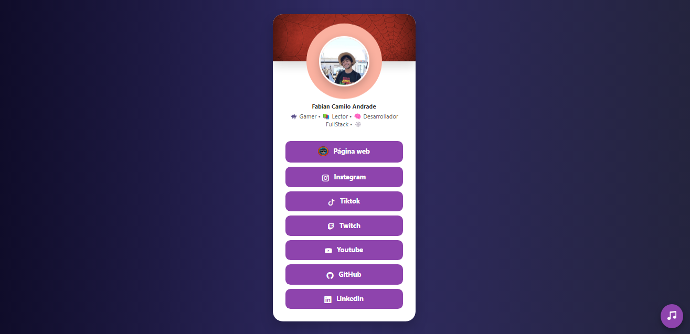
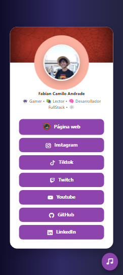

# Creating a new Linktree from the Ashes
Has been a while since i wanted to open an account on the Linktree page, but instead of doing that i tell myself "Maybe i can do it with the things i already know in web development." So
now i'm here, presenting the new way to show every single social media profile about myself. If you are here, you can take it and improve it too, because this can be take it as a template
> [!NOTE]
> This project was made using the basics of web development
## Tech Stack used on the Project

## Browser View
This result includes the use of my favorite songs at the moment, and is a pretty good way to do it.

## Responsive View
The view in smartphones is going to change thanks to the use of the CSS styles.

> [!IMPORTANT]
> Everything you do, do it with love